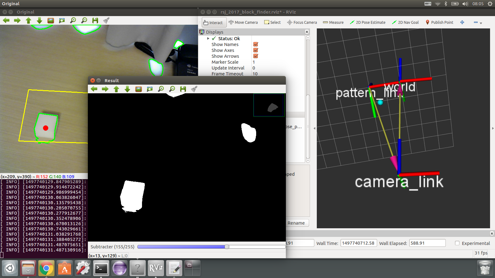

本セクションでは、前セクションで取得した画像を処理する方法について説明します。特にOpenCVを用いて処理する方法について説明します。その後、ブロックを検出し、ブロックの位置を出力する一連の処理について説明します。

- Table of contents
{:toc}


## OpenCVの概要

OpenCV（Open Source Computer Vision Library）は無料の画像処理ライブラリーです。Linuxの他、WindowsやMacOSでも利用することができ、現在、多くの画像処理研究で利用されています。例えば、OpenCVを利用することで、従来手法との精度比較を簡単に行うことができます。

ROSでOpenCVを利用するときの注意点としては、バージョン管理があります。基本的に、使用中のROSがリリースされたときの最新バージョンのOpenCVを使用することになります。ROSのバージョンとOpenCVのバージョンの対応を下表にまとめておきます。本セミナーではROS 16.04を使用しているため、OpenCV 3.1を利用することになります。

|ROSのバージョン|OpenCVのバージョン|
|17.04 (Lunar Loggerhead)|3.2.0|
|16.04 (Kinetic Kame)|3.1.0 [online documentation](https://docs.opencv.org/3.1.0/)|
|15.04 (Jade Turtle)|2.4.11|
|14.04 (Indigo Igloo)|2.4.8|


## OpenCVの準備

1. まず、OpenCVをインストールします。

   ```shell
   sudo apt-get install ros-kinetic-vision-opencv
   sudo apt-get install python-opencv
   sudo apt-get install libopencv-dev
   ```

1. 上記に加えて、本セミナーではROSパッケージ「`cv_bridge`」を利用します。このパッケージを用いることで、ROSの画像データ（Image Message）とOpenCVの画像データ（IplImage）を相互に変換することができます。つまり、Image MessageをIplImageへ変換し、OpenCVを用いて処理を施し、Image Messageへ戻すという一連の処理を記述することができます。（※IplはIntel Image Processing Libraryの略で、OpenCV 1.xで使用されている型になります。そのため、本セミナーではIplImageをOpenCV 2.x以降で使用されている型「`cv::Mat`」へ更に変換し、画像処理を行います。）

   ```shell
   sudo apt-get install ros-kinetic-cv-camera
   ```

本セミナーの実施に必要となる準備は以上となりますが、実際には下記のとおり設定を変更する必要もあります。（※本セミナーでは事前に設定してあります。）

1. OpenCVと正しくコンパイルできるよう、OpenCVを利用するROSパッケージでは下記のとおりCMakeLists.txtを修正します。

   ```cmake
   find_package(OpenCV REQUIRED)
   include_directories(/usr/local/include ${catkin_INCLUDE_DIRS} ${OpenCV_INCLUDE_DIRS})
   target_link_libraries(dfollow ${catkin_LIBRARIES} ${OpenCV_LIBRARIES})
   ```

1. ROSパッケージを管理するためのpackage.xmlも修正します。通常、Ubuntu 16.04ではOpenCV 3.xを使用しますが、互換性を保つために敢えて`opencv2`と指定します。

   ```xml
   <build_depend>opencv2</build_depend>
   <run_depend>opencv2</run_depend>
   ```


## 画像処理パッケージの準備

1. 画像処理用のROSパッケージをダウンロードします。ディレクトリ「`rsj_2017_block_finder`」が作成されたことを確認します。

   ```shell
   $ cd ~/block_finder_ws/src
   $ git clone https://github.com/Suzuki1984/rsj_2017_block_finder.git
   $ ls
   CMakeLists.txt  rsj_2017_block_finder
   ```

1. 次に、ビルドします。ビルド結果が[100%]と表示されたことを確認します。

   ```shell
   $ cd ~/block_finder_ws/
   $ catkin_make
   ```

1. ワークスペース内のROSパッケージが利用できるよう、環境を設定します。

   ```shell
   $ source devel/setup.bash
   ```

これで画像処理パッケージ「`rsj_2017_block_finder`」が利用可能になりました。


## カメラキャリブレーション

画像処理を行う前に、カメラの内部パラメーターを設定します。本セミナーには、ROSパッケージを利用してキャリブレーションを行います。

1. チェッカーボードの頂点の数と四角形の大きさ（1辺の長さ）を確認します。このとき、四角形の数を数えないように注意してください。黒の四角形が繋がっている点を数えます。また、長さの単位がメートルであることにも注意してください。

1. ROSパッケージ「`camera_calibration`」をインストールします。

   ```shell
   $ sudo apt-get install ros-kinetic-camera-calibration
   ```

1. チェッカーボードを平らな机の上に固定します。

1. 同パッケージを実行します。デバイス番号が0以外の場合は~/block_finder_ws/src/rsj_2017_block_finder/launch/usb_cam_calib.launchのvideo_deviceの値を修正してください。

   ```shell
   # １つ目のターミナル
   $ cd ~/block_finder_ws/
   $ source devel/setup.bash
   $ roslaunch rsj_2017_block_finder usb_cam_calib.launch
   ```
   ```shell
   # ２つ目のターミナル
   $ cd ~/block_finder_ws/
   $ source devel/setup.bash
   $ rosrun camera_calibration cameracalibrator.py --size 8x6 --square 0.0285 image:=/camera/image_raw camera:=/camera
   ```

1. カメラを手で持ち、位置や姿勢を動かします。XやYは左右や前後に動かすことで、Sizeは上下に動かすことで、Skewは斜めから撮影することで、少しずつバーが伸びていきます。

1. 全てのバーが緑色になったらCALIBRATEボタンを押します。ボタンを押したあと、処理に数分かかる場合がありますので、ボタンを連打しないように注意してください。

   __サンプル数が多いと、Segmentation faultなどを発生し、キャリブレーションに失敗することがあります。少ないサンプルでバーを緑色にするようにしましょう。__

1. チェッカーボードを撮影し、頂点や直線が正しく表示されていることを確認します。

1. COMMITボタンを押します。内部パラメーターが記述されたYAMLファイルが~/.ros/camera_info/elecom_ucam.yamlに作成されます。

以上でキャリブレーションは完了です。

本セミナーではカメラの位置や姿勢を自由に動かすことができました。しかし、カメラが天井に固定されているなど、カメラを自由に動かせない場合でも、キャリブレーションを行う必要があります。その場合は、チェッカーボードを平らな板に貼り付け、人間が板を上下左右に動かしたり、カメラに対して傾けたりしてキャリブレーションを行います。


## ブロック位置推定（基礎編）

1. まず、画像処理パッケージの内容を確認します。

   ```shell
   $ cd ~/block_finder_ws/src/rsj_2017_block_finder
   $ ls
   CMakeLists.txt  config  launch  package.xml  readme.md  src
   $ cd launch
   $ ls
   block_finder.launch  block_finder_w_stp.launch  usb_cam_calib.launch
   ```

1. ディレクトリーlaunchの中にはblock_finder.launchとblock_finder_w_stp.launchがあります。ここでは後者のファイルを確認してみます。後者のlaunchファイルでは4つのノードを起動します。publish（配信）とsubscribe（購読）の関係性を以下に示します。

   ```xml
   <?xml version="1.0"?>
   <launch>
     <node pkg="usb_cam" type="usb_cam_node" name="camera" output="screen">
       <param name="camera_name" value="elecom_ucam"/>
       <param name="camera_frame_id" value="camera_link"/>
       <param name="video_device" value="/dev/video0"/>
       <param name="image_width" value="640"/>
       <param name="image_height" value="480"/>
       <param name="pixel_format" value="yuyv"/>
       <param name="io_method" value="mmap"/>
     </node>
     <node pkg="tf" type="static_transform_publisher" name="camera_transform_publisher" args="0 0 -0.2 0 0 0 1 /world /camera_link 1"/>
     <node pkg="rsj_2017_block_finder" type="block_finder" name="block_finder" args="$(arg method)" output="screen">
       <param name="block_area_min" value="1000"/>
       <param name="block_area_max" value="2000"/>
     </node>
     <node pkg="rviz" type="rviz" name="rviz" args="-d $(find rsj_2017_block_finder)/config/rsj_2017_block_finder.rviz"/>
   </launch>
   ```

   camera
   : 画像メッセージをPublishします。

   camera_transform_publisher
   : World座標系の原点から見たCamera座標系の原点の位置を適当にPublishします。

   block_finder
   : 画像メッセージを購読し、処理し、World座標系におけるブロックの位置をPublishします。

   rviz
   : World座標系、Camera座標系、ブロックの位置を表示します。


### 画像処理プログラムの概要

1. カメラを接続し、カメラのデバイス番号を確認します。（デバイス番号が0以外の場合は適宜、launchファイルを修正してください。）

1. カメラを三脚に取り付け、チェッカーボードの四隅が撮影できるように設置します。このとき、できる限り上から覗くように設置すると、ブロックの位置を精度良く推定することができます。

1. 下記のコマンドで実行します。カラー画像、グレー画像、RVizの３つの画面が開きます。チェッカーボード上に黄色の四角形が表示されれば正常に起動しています。

   ```shell
   $ cd ~/block_finder_ws/
   $ source devel/setup.bash
   $ roslaunch rsj_2017_block_finder block_finder_w_stp.launch method:=1
   ```

   

1. チェッカーボードの上に厚紙を置きます。そして、黄色の四角形の中に収まるよう、厚紙の上にブロックを1つ置きます。

1. ここで、Publishされているトピックの値をROSツール「rostopic」を使用して確認してみます。別のターミナルを開いて、下記のとおり実行してみてください。ブロック領域の面積を確認することができます。なお、セミナー用の画像処理パッケージでは、面積が大きすぎる場合や小さすぎる場合はブロックの位置をPublishしないようにしています。

   ```shell
   # 新しいターミナル
   $ rostopic echo /block_finder/block_size_max
   ```

1. 画像上の面積は、カメラの位置などによって変化します。そのため、launchファイル内のblock_area_min（下限値）とblock_area_max（上限値）を変更することで、ブロックの検出精度を向上してみましょう。なお、プログラムは「Ctrl」キー＋「c」キーで終了することができます。

1. ブロックの位置をRVizで確認してみましょう。TFは座標系（フレーム）を表示することができますが、R色がX軸、G色がY軸、B色がZ軸を表します。また、PointStampedはHeaderとPointが組み合わさったメッセージ型で、Headerで位置データを取得した時刻、Pointで位置データを表現することができます。本セミナーでは、この型を利用してブロックの位置をPublishしています。実物のブロックを移動させ、RViz上のPointStampedが移動することを確認してみましょう。

   

このセクションでは、World座標系からCamera座標系までの変換ベクトルを適当に与えています。最後のセクションでは、ROSパッケージ「crane_plus_camera_calibration」を利用して同ベクトルを求め、マニピュレーターがブロックを正しく把持できるようにします。


### 画像処理法

ブロックを検出するための画像処理について説明します。

まず、関数「GaussianBlur」で平滑化を行います。平滑化を行うことで、後述の2値化処理の結果が安定します。この関数の第3引数ではフィルタのサイズを指定することができ、cv::Size(5, 5)やcv::Size(13, 13)など、正の奇数で指定します。

次に、関数「threshold」で2値化します。第3引数が閾値となり、この閾値を境に各ピクセルに０と１の値を与えていきます。本セミナーではGUI上のトラックバーを使用して動作中に値を変更できるようにしてあります。トラックバーを直接ドラッグするほか、トラックバーの左右をクリックすることで5刻みで値を増減することもできます。（※トラックバーの初期値を変更する場合は、cppファイルの値を更新し、catkin_makeでビルドする必要があります。）

そして、関数「findContours」を使用してブロックを検出します。第3引数では近似手法を指定することができ、現在はCV_CHAIN_APPROX_NONEとなっています。その他には、CV_CHAIN_APPROX_SIMPLEやCV_CHAIN_APPROX_TC89_L1と設定することができます。

- `CV_CHAIN_APPROX_NONE`
  : 全ての点を保存します。
- `CV_CHAIN_APPROX_SIMPLE`
  : 端点のみを保存します。つまり、輪郭を表現する点群を圧縮します。
- `CV_CHAIN_APPROX_TC89_L1`
  : Teh-Chinアルゴリズムに基づいて輪郭を表現する点群を選択します。NONEとSIMPLEの中間に当たります。

それでは、実際に値を変更してみましょう。値を変更し、ファイルを上書きしたら、下記のとおりビルドし、実行します。

```shell
$ cd ~/block_finder_ws/
$ catkin_make
$ source devel/setup.bash
$ roslaunch rsj_2017_block_finder block_finder_w_stp.launch method:=1
```


### 画像の表示

OpenCVでは、関数「inshow」を使用して画像を表示します。関数「imshow」のあとに関数「waitKey」を呼び出することで、画像が表示されます。関数「waitKey」は一定時間キー入力を待つ関数ですが、ここではスリープ関数のような意味を持ちます。（※なお、繰り返し処理を行わない画像処理の場合、引数を0と指定することで、キー入力が行われるまで画像を表示しておくことができます。）

ウィンドウの名前は関数「namedWindow」で、ウィンドウの位置は関数「moveWindow」で指定することができます。また、デストラクタ「~BlockFinder」の中に関数「destroyWindow」を記述しておくことで、メモリの開放忘れを予防することができます。全てのウィンドウを破棄する関数「destroyAllWindows」もあります。


### ブロック位置の出力

2次元画像上でブロックの位置を推定したあとは、下図のとおりWorld座標系での位置へ変換し、Publishします。


OpenCVの関数「projectPoints」を利用することで、2次元画像上の位置とチェッカーボードの左上を原点とした3次元空間「target_frame」上の位置の対応関係を得ることができます。

そして、tfの関数「transformPoint」を利用することで、ボード座標系「target_frame」の位置を、Camera座標系「camera_frame」を経由して、World座標系「fixed_frame」の位置へと変換することができます。


## ブロック位置推定（発展編）

基本編で使用した画像処理（2値化処理）では、チェッカーボードの四角形をブロックとして誤認識してしまいます。そのため、発展編では、チェッカーボードの上でもスポンジを検出できるように改良します。

### 背景差分法

本セミナーでは背景差分（動的背景差分）を利用します。OpenCVには下記の手法が実装されています。

- 混合正規分布法（MoG：Mixture of Gaussian Distribution）
  - createBackgroundSubtractorMOG2
- k近傍法（kNN：k-nearest neighbor）
  - createBackgroundSubtractorKNN

また、OpenCVにはopencv_contribという追加モジュール群が存在します。このモジュールをインストールすることで下記の手法も使用することができます。

- ベイズ推定法（GMG: Godbehere、Matsukawa、Goldberg）
  - createBackgroundSubtractorGMG

OpenCVはバージョンが変わると、記述方法や機能が大幅に変更されます。例えば、2から3へバージョンが変わったときは、kNNなどが追加されましたが、GMGなどはcontribへ移動されました。注意してください。


### 混合正規分布法

混合正規分布法の関数「createBackgroundSubtractorMOG2」では、下記のとおり３つの引数を指定することができます。

```c++
Ptr<BackgroundSubtractorMOG2> cv::createBackgroundSubtractorMOG2(int history=500, double varThreshold=16, bool detectShadows=true)
```

第1引数では、過去何フレームまでを分布推定（モデル推定）に利用するかを指定することができます。

第2引数では、各ピクセルが背景モデルに含まれるかどうかを判断するための閾値を指定することができます。

第3引数では、影の影響を考慮するかどうかを指定することができます。trueにすると計算速度が若干低下しますが、推定精度を向上することができます。

それでは混合正規分布法を試してみましょう。

下記のとおり、roslaunchを実行するときにmethod:=2と指定してください。これにより、メンバー変数「method」が2に上書きされた状態でプログラムを実行することができます。

```shell
$ roslaunch rsj_2017_block_finder block_finder_w_stp.launch method:=2
```

下記のように、色々な値を設定し、結果の違いを確認してみましょう。C++ではプログラムを変更するたびにビルド（catkin_make）する必要があります。

```c++
# Pattern A
pMOG2 = cv::createBackgroundSubtractorMOG2();
# Pattern B
pMOG2 = cv::createBackgroundSubtractorMOG2(1000);
# Pattern C
pMOG2 = cv::createBackgroundSubtractorMOG2(1000, 8);
```


## 参考情報

OpenCVには多くのサンプルプログラムが用意されており、研究開発の初期段階において、様々な手法を試すことができます。そして、同サンプルプログラムをROSノード化したROSパッケージ「opencv_apps」があります。（→[Wikiページ](http://wiki.ros.org/opencv_apps)）

インストールは下記のとおり行います。

```shell
$ sudo apt-get install ros-kinetic-opencv-apps
```

例えば、画像内から円形を抽出するサンプルプログラムは下記のとおり実行できます。

```shell
$ roslaunch opencv_apps hough_circles.launch image:=/usb_cam_node/image_raw
```

また、画像内から人間の顔を抽出するサンプルプログラムは下記のとおり実行できます。

```shell
$ roslaunch opencv_apps face_detection.launch image:=/usb_cam_node/image_raw
```

以上